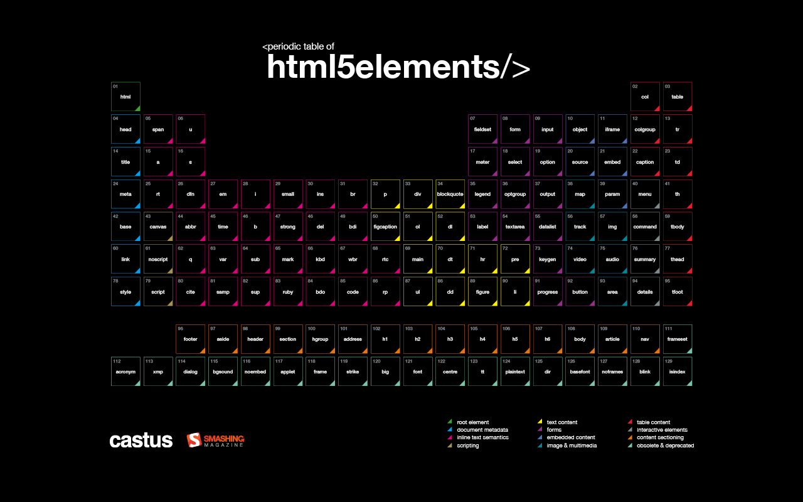

# HTML é tudo que você precisa!

> Material para acompanhar apresentação online de HTML no
> [meetup](https://www.meetup.com/opensanca/events/272507261/)

[Esse repositório](https://github.com/marcel0ll/apresentacao-html) contém o
código de um [editor em tempo
real](https://marcel0ll.github.io/apresentacao-html) para que você possa
acompanhar, ver alguns exemplos ou experimentar por conta própria. Lembre-se de que
aprender é um processo ativo e não passivo!

Hoje em dia, é fácil nos perdermos na pletora de bibliotecas para javascript,
tentando criar um site, e nos esquecermos de que para isso você não precisa
de javascript. O velho HTML é mais do que suficiente e, por mais que eu acredite
ser benéfico adicionar javascript ao seu site, é sempre importante saber muito
bem o básico.

Então, hoje eu vou acompanhar você no básico do básico de HTML, como o seu
navegador o lê e renderiza, o que é uma requisição HTTP e
até mesmo onde o CSS entra na jogada (mas não entrarei em muitos detalhes de CSS).

## O que é HTML?

HTML significa linguagem de marcação de hyper texto e é uma [linguagem de
programação declarativa sem completude de
Turing](https://www.youtube.com/watch?v=4A2mWqLUpzw).  Isso
significa que não é possível fazer tudo com HTML e, mais importante, que ele não é uma linguagem
para listar ordens para o computador. Aqui é preciso 'explicar' para o computador como
você quer algo.

O HTML foi inventado no começo da internet para troca fácil de documentos pela
rede mundial de computadores (WWW) usando o protocolo HTTP. Uma de suas funções
mais inovadoras foi permitir que um documento possa estar conectado a quantos outros
documentos alguém quiser. Isso é a base do que você usa hoje no seu navegador.

## O que é HTTP?

HTTP significa protocolo de transferência de hyper texto, e como o nome já diz tem
uma forte relação com HTML, pelo menos em relação a quando e por que ele foi inventado.

HTTP é um protocolo de transferência construído em cima do protocolo de controle
de transmissão (TCP) para transferir arquivos através da WWW de forma confiável,
permitindo a existência de sistemas de informação de hyper mídia. Em outras
palavras, é o que permite a você clicar em um link e abrir outra página ou a foto
de um gato.

> Nota: HTTP pode ser adaptado para usar o protocolo de datagrama de usuário
> (UDP)

## Como o navegador interage com tudo isso?

Um navegador é basicamente um cliente de HTTP que requisita arquivos através da
internet. Ele busca um arquivo de um servidor HTTP.

> Nota: Uma página na internet é um arquivo

Então, quando você abre o google.com, por exemplo, o navegador requisita ao servidor que está
responsável por esse domínio (google.com) o endereço "/" e o servidor te
responde com um arquivo HTML que seu navegador irá imprimir na tela.

> Nota: Clique com o botão direito no seu navegador e olhe o código fonte da
> página. Você vai ver um grande arquivo HTML

> Nota: Algumas partes do seu site são impressas na verdade pelo seu sistema
> operacional (SO) e não pelo navegador. Um exemplo disso são menus de listagem
> (`<select>`), que no seu computador irão aparecer de um jeito e em celulares
> aparecem de outro completamente diferente.

## O que posso escrever com HTML?

Basicamente texto. Muito texto.

Como já dito antes, você também pode apontar para outros arquivos que não são
HTML e seu navegador se esforçará ao máximo para mostrá-los. Por exemplo, você
talvez queira mostrar uma imagem ao lado do seu lindo texto, então o que você
faz é escrever uma marcação que aponta para outro arquivo (uma imagem). Seu
navegador fará uma segunda requisição por trás das cortinas, pegará a resposta e
irá imprimir a imagem na tela.

Note que, por mais que seja muito comum navegadores encaixarem o arquivo de
imagem dentro da mesma visão da página, nem todo navegador é assim ou pode ser
configurado de forma diferente. Isso é o caso em navegadores como o
[Lynx](https://lynx.browser.org/), um navegador de terminal, que, até onde sei,
só mostra textos.

Algumas pessoas podem configurar o navegador para não carregar imagens a fim de
testar acessibilidade ou simular um navegador textual. Ou eles podem simplesmente
não gostar de imagens.

## Sintaxe do HTML

HTML é escrito usando tags do tipo `<tag></tag>`. Cada tag tem o seu propósito:
adicionar conteúdo dentro do documento, adicionar informação sobre o documento
ou adicionar estrutura semântica ao documento.

Dentro de cada tag você pode declarar multiplos atributos usando a sintaxe
`chave="valor"` ou só `chave`. Um exemplo: `

Novo artigo 
`.

A maioria das tags de HTML precisa ter abertura (`<>`) e fechamento (`</>`), mas
algumas podem ser abertas e fechadas com uma única declaração: `<input
type="text" />`.

Essa é uma imagem muito legal de uma "tabela periódica de HTML". Foi feita pelo
Castus e eu a encontrei na [Smashing
Magazine](https://www.smashingmagazine.com/2015/05/desktop-wallpaper-calendars-june-2015/#periodic-table-of-html5-elements)

Essas eram todas as tags que existiam quando a table foi feita em 2015. Hoje
pode estar um pouco diferente.

Criei uma série de exemplos de HTML que podem ser encontrados [nesse
editor](https://marcel0ll.github.io/apresentacao-html) 

Espero que tenha aproveitado. Continue programando!

marcel0ll

